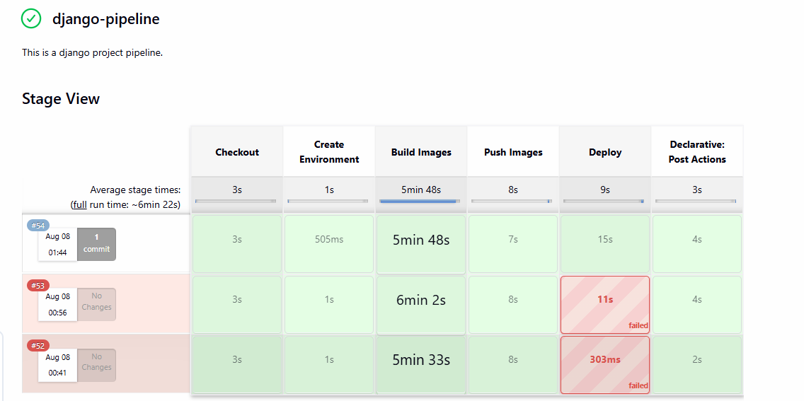
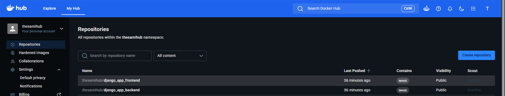
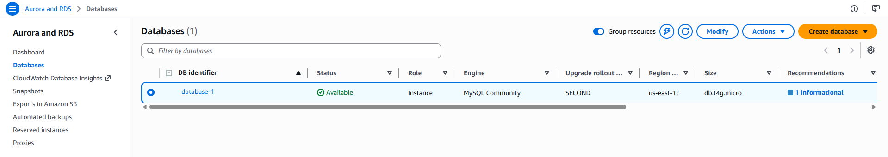
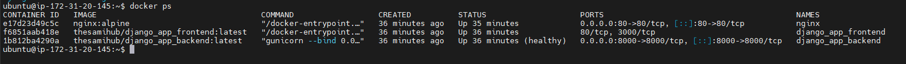
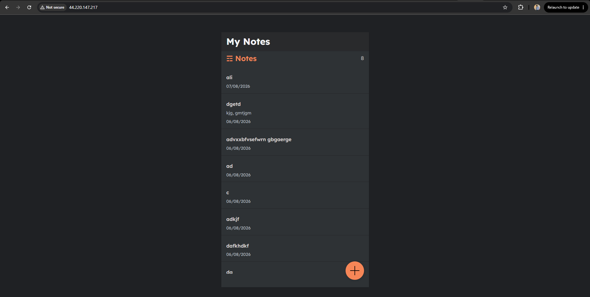

# Django + React + MySQL + Nginx | Docker | Jenkins | AWS EC2 | Amazon RDS

A production-ready full-stack Notes application built with **Django REST Framework** and **React**, containerized with **Docker**, reverse proxied with **Nginx**, deployed on **AWS EC2**, using **Amazon RDS (MySQL)** as the production database, and automated through a **Jenkins CI/CD Pipeline**.

---

# Live Architecture


```
                 Developer
                     │
                     ▼
                 GitHub Repository
                     │
                     ▼
             Jenkins CI/CD Pipeline
                     │
      ┌──────────────┴──────────────┐
      │                             │
      ▼                             ▼
 Build Docker Images          Push to Docker Hub
      │                             │
      └──────────────┬──────────────┘
                     ▼
          SSH Deployment to EC2
                     │
                     ▼
             Docker Compose (Prod)
                     │
          ┌──────────┴──────────┐
          ▼                     ▼
     Django Backend         React Frontend
             │
             ▼
       Amazon RDS MySQL
```

---

# Tech Stack

### Backend

- Django
- Django REST Framework
- Gunicorn

### Frontend

- React

### Database

- MySQL (Development)
- Amazon RDS MySQL (Production)

### DevOps

- Docker
- Docker Compose
- Docker Hub
- Jenkins
- Nginx

### Cloud

- AWS EC2
- Amazon RDS

---

# Features

- REST API using Django REST Framework
- React frontend
- CRUD Notes Application
- Dockerized backend
- Dockerized frontend
- Nginx Reverse Proxy
- Docker Compose development environment
- Docker Compose production environment
- Production database hosted on Amazon RDS
- Jenkins CI/CD Pipeline
- Docker Hub image registry
- Automated deployment to AWS EC2
- Automatic Django migrations during deployment
- Environment variables managed securely

---

# Project Structure

```
.
├── api/
├── mynotes/
├── nginx/
│   └── nginx.conf
├── notesapp/
├── screenshots/
├── Dockerfile
├── docker-compose.yml
├── docker-compose-prod.yml
├── Jenkinsfile
├── requirements.txt
├── Procfile
├── .env.example
└── README.md
```

---

# Development Architecture

```
Browser
    │
    ▼
 Nginx (Port 80)
     │
 ┌───┴─────────┐
 ▼             ▼
React      Django API
                 │
                 ▼
             MySQL Container
```

Development uses a MySQL Docker container.

---

# Production Architecture

```
Internet
    │
    ▼
AWS EC2
    │
    ▼
Nginx
    │
 ┌──┴─────────┐
 ▼            ▼
React      Django
               │
               ▼
         Amazon RDS
```

Production uses:

- Amazon RDS
- Docker Hub images
- Docker Compose Production
- Jenkins Deployment

---

# CI/CD Pipeline

The project is deployed automatically using Jenkins.

Pipeline Flow:

1. Clone source code from GitHub
2. Build Backend Docker Image
3. Build Frontend Docker Image
4. Push Images to Docker Hub
5. SSH into Production EC2
6. Pull latest Docker Images
7. Deploy containers using Docker Compose
8. Run Django database migrations

---

# Jenkins Pipeline



---

# Docker Hub Images

Backend

```
thesamihub/django_app_backend
```

Frontend

```
thesamihub/django_app_frontend
```

---

# Docker Hub



---

# Amazon RDS

Production uses Amazon RDS instead of a MySQL Docker container.

Benefits:

- Managed database
- Automated backups
- High Availability
- Better Production Architecture

---

# Amazon RDS



---

# EC2 Deployment

Application is hosted inside Docker containers running on AWS EC2.

Services running:

- Django
- React
- Nginx

---

# Docker Containers



---

# Environment Variables

Create a `.env` file from `.env.example`

Development

```env
DB_NAME=test_db
DB_USER=root
DB_PASSWORD=your_password
DB_HOST=db
DB_PORT=3306
```

Production

```env
DB_NAME=your_rds_database
DB_USER=your_rds_user
DB_PASSWORD=your_rds_password
DB_HOST=your_rds_endpoint
DB_PORT=3306
SECRET_KEY=your_secret_key
DEBUG=False
```

---

# Running Locally

Clone repository

```bash
git clone https://github.com/thesamihub/django-react-docker-nginx.git
cd django-react-docker-nginx
```

Create environment file

```bash
cp .env.example .env
```

Build and start

```bash
docker compose up --build
```

Run migrations

```bash
docker compose exec django_app_backend python manage.py migrate
```

Open

Frontend

```
http://localhost
```

Backend

```
http://localhost/api/
```

---

# Production Deployment

Production deployment uses

```
docker-compose-prod.yml
```

The production compose file

- Pulls Docker Hub images
- Connects Django to Amazon RDS
- Does not build locally
- Is deployed automatically through Jenkins

---

# Nginx Routing

```
/
```

→ React Frontend

```
/api/
```

→ Django Backend

---

# Useful Docker Commands

Build

```bash
docker compose build
```

Run

```bash
docker compose up -d
```

Stop

```bash
docker compose down
```

View Logs

```bash
docker compose logs -f
```

Running Containers

```bash
docker ps
```

---

# Application



---

# DevOps Skills Demonstrated

- Docker
- Docker Compose
- Multi-container applications
- Nginx Reverse Proxy
- Django REST Framework
- React
- AWS EC2
- Amazon RDS
- Jenkins CI/CD
- Docker Hub
- Production Deployment
- Environment Variable Management
- SSH Deployment
- Automated Database Migration

---

# Future Improvements

- Kubernetes Deployment
- HTTPS with Let's Encrypt
- Terraform Infrastructure
- Prometheus & Grafana Monitoring
- Blue-Green Deployment
- Auto Scaling Group
- AWS Load Balancer

---

# License

This project was built for learning, DevOps practice, and portfolio demonstration.
